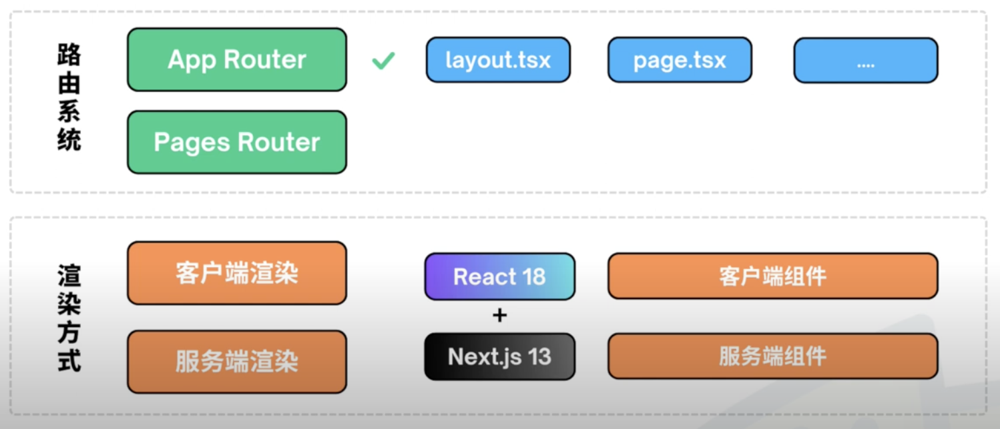

# React 入门实战教程

本课程我们将学习 React 的基础知识， React 是目前最流行的 JavaScript 库，使用 React 可以高效的开发 Web 前端项目，这门课程我们采用边学边开发的模式，通过一个类似 ChatGPT 前端的实战项目来学习 React 基础知识，除了 React 的基础知识以外，还包括 Next.js 和 tailwindcss 等框架的使用。在学习这个课程之前需要先学习 HTML 和 CSS 以及 JavaScript，如果你还没学习过这些内容，可以查看我们的 HTML 和 CSS 入门教程以及 JavaScript 基础教程。


# Dayuan Note

## Prerequisite
- Install Node.js > 16.8.
- Install VS Code.

## Class 1 ChatGPT实战项目

Before the offical of React recommended to use "creat react app" tool to creat React app.

But now no. The offical recommends to use "create next js" to create React project.

https://react.dev/learn/start-a-new-react-project

Create a new folder: [01-dy](01-dy).
```
npx create-next-app@13.4.12 # use the same version as the video
```


The default auto generated folder:


Open [Readmd.md](01-dy/chatgpt-app/README.md). Follow its instruction to run the program:   
```
npm run dev
```


Open the link as it shows:


## Class 2 Next.js基础知识


Next.js 两种路由方式：Pages Router VS APP Router

https://nextjs.org/docs

We use Next.js App Router for this project. Recommended by Next.js 13. Pages Router is older.


渲染方式：
- 传统的服务端渲染：把网页内容都写在html里面。html和css文件都在服务器，请求后返回包含完整网页内容的html和css。
- 这里的客户端渲染：主要代码是js或ts写的。js部署在服务器。请求后返回的是非常高度抽象概括性的简单的html模板文件，以及引入的少量js文件，几乎不含网页实质内容。最终呈现给用户的内容，是在浏览器中由js代码生成。 
  - Cons：
    - 首次加载慢。请求的html/js简单但是浏览器根据js动态生成html。
    - 对SEO不友好，因为爬虫只抓去html内容。这时候又想到服务端渲染的好处了。
- 所以人们想要两者结合。
- React 18 and Next.js 13之后，支持开发者在组件级别选择渲染方式。所有组件默认是服务端渲染。
  - 官方建议是优先使用服务端组件，只有交互相关使用客户端组件。
    - https://nextjs.org/docs/app/building-your-application/rendering/partial-prerendering
    - 


## Class 3 React基础知识

- 组件
  - 页面拆分成组件
  - 方便复用，维护代码
- 创建
  - 函数方式创建组件 - 函数组件 
  - 类组件 - 官方不再推荐

复制01-dy/chatgpt-app 为03-dy/chatgpt-app方便进一步修改代码

chatgpt-app
- 左边导航栏
- 右边内容区

创建components folder
创建home folder存放主页相关文件
创建Navigation.tsx文件组件存放导航栏部分代码。写其内容。创建函数组件设置默认导出。
```
export default function Navigation() {
    return <nav>Navigation</nav>
}
```

创建Main.tsx文件组件存放内容部分代码。写其内容。创建函数组件设置默认导出。包含网页主体内容所以用\<main\>做根元素。
```
export default function Main({ counter }: { counter: number }) {
    return <main>Main Content {counter}</main>
}
```

在主页的page文件中引入这两个组件。（需要补充app/chat路径文件。）
删掉app/page.tsx大部分内容，不需要他们。新建chat folder对应url/chat路由。

参数。

条件表达式，？：表达式。

展示列表list。

事件处理：

和html一样，只需要给响应事件的元素绑定事件处理函数。注意如果需要交互，那么使用客户端组件，添加```"use client"```指令。

直接定义counter并且onclick时候+=1并不工作。因为react的渲染时只有状态改变时才重新渲染，而react并不知道counter的状态。另一方面，重新渲染会让counter值重置。

这是需要使用useState()来告诉react counter的状态```const [counter] = useState(0)```这样不光react知道了counter的状态，还能在react重新渲染时保持counter原本的值而不是被重置。


## Class 4 使用Tailwind CSS


使用预定义的css类，而不需自己写css代码。

官方示例。如果background color: https://tailwindcss.com/docs/background-color 

## Class 5 全局状态管理(上)


按照rect的图标模块方便使用：```npm i react-icons```